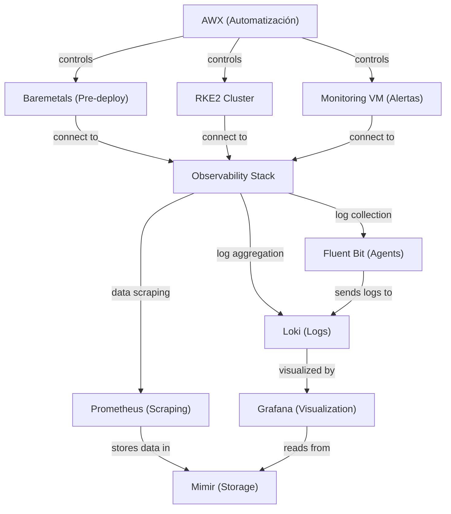

# Observa Platform

A comprehensive open-source observability platform for RKE2 Kubernetes environments,
integrating metrics, logs, and traces into a unified monitoring solution.



## What is Observa?

Observa Platform is an end-to-end observability solution built on RKE2
(Rancher Kubernetes Engine 2) that integrates the three essential pillars of observability:

- **Metrics**: Long-term metrics storage and visualization with Prometheus and Mimir
- **Logs**: Centralized log collection and querying with Fluent Bit and Loki
- **Traces**: Distributed tracing with OpenTelemetry and Tempo

What makes Observa unique is its integrated approach, providing correlation
between all observability signals through a unified platform and
an automation-first deployment strategy using Ansible AWX.

## Key Features

- **Complete MLT Stack**: Integrates metrics, logs, and traces in one system
- **Advanced Correlation**: Links data across all three observability pillars
- **Role-Based Monitoring**: Tailored dashboards based on node roles
(control plane, app, infra)
- **Long-Term Data Retention**: Efficient storage with Mimir, Loki, and Tempo
- **Open Source Foundation**: Built entirely on best-in-class open source
components
- **Automation First**: Everything deployed through Ansible for consistency
and repeatability
- **Progressive Implementation**: Build from lab environment to
production-ready platform

## Architecture

Observa Platform consists of several key components:

- **RKE2 Kubernetes cluster**: Provides the foundation
- **Prometheus + Mimir**: Metrics collection and long-term storage
- **Fluent Bit + Loki**: Log collection and storage
- **OpenTelemetry + Tempo**: Distributed tracing
- **Grafana**: Unified visualization layer

For a detailed architecture diagram, see
[architecture documentation](./architecture/README.md).

## Getting Started

### Prerequisites

- VM environment (VMware Fusion/Workstation, VirtualBox, etc.)
- At least 96GB RAM for the complete lab environment
- Minimum 200GB SSD storage
- AlmaLinux 9 (or compatible RHEL derivative)

### Phase 1: Laboratory Environment Setup

Follow our [Phase 1 documentation](./docs/phase1-lab-setup.md)
to set up the initial laboratory environment:

1. Configure network in virtualization platform
2. Create base VMs (DHCP, AWX, Monitoring)
3. Configure DHCP server
4. Deploy AWX for automation
5. Set up pre-deployment monitoring

### Subsequent Phases

- [Phase 2: RKE2 Kubernetes Deployment](./docs/phase2-rke2-deployment.md)
- [Phase 3: Pre-deployment Monitoring](./docs/phase3-pre-monitoring.md)
- [Phase 4: Observability Stack Deployment](./docs/phase4-observability-stack.md)
- [Phase 5: Production Scaling](./docs/phase5-production-scaling.md)

## Components

| Component | Purpose | Configuration |
|-----------|---------|---------------|
| AlmaLinux 9 | Base operating system | [OS Configuration](./docs/os-configuration.md) |
| RKE2 | Kubernetes distribution | [RKE2 Setup](./docs/rke2-setup.md) |
| AWX | Ansible automation platform | [AWX Configuration](./docs/awx-configuration.md) |
| Prometheus | Metrics collection | [Prometheus Setup](./docs/prometheus-setup.md) |
| Mimir | Long-term metrics storage | [Mimir Configuration](./docs/mimir-configuration.md) |
| Loki | Log storage and querying | [Loki Setup](./docs/loki-setup.md) |
| Fluent Bit | Log collection | [Fluent Bit Configuration](./docs/fluentbit-setup.md) |
| Tempo | Distributed tracing backend | [Tempo Setup](./docs/tempo-setup.md) |
| OpenTelemetry | Tracing collection | [OpenTelemetry Configuration](./docs/opentelemetry-setup.md) |
| Grafana | Visualization | [Grafana Dashboards](./dashboards/README.md) |

## Project Structure

```bash

observa-platform/
├── architecture/         # Architecture diagrams and specifications
├── ansible/              # Ansible playbooks and roles
├── kubernetes/           # Kubernetes manifests
├── dashboards/           # Grafana dashboards
├── docs/                 # Detailed documentation
└── examples/             # Example applications and configurations

```

## Contributing

We welcome contributions to the Observa Platform! Please see our
[Contributing Guide](CONTRIBUTING.md) for details on how to get involved.

## License

This project is licensed under the MIT License - see the
[LICENSE](LICENSE) file for details.

## Acknowledgments

- The RKE2 team for providing a robust Kubernetes distribution
- The creators and maintainers of Prometheus, Grafana, Loki, Tempo,
and the entire observability ecosystem
- The AlmaLinux community for providing a stable RHEL-compatible base
